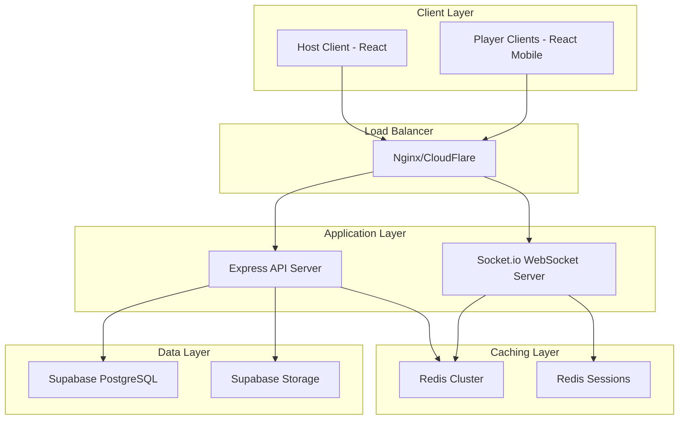

# Design Document

## Overview

The QuizGo core platform implements a scalable real-time quiz system using a microservices architecture with React frontend, Node.js backend, Supabase for data persistence, and Redis for caching and real-time state management. The system is designed to handle 200+ concurrent players with sub-second response times.

## Architecture

### High-Level Architecture



### System Components

1. **Frontend Applications**
   - Host Interface: Desktop-optimized React app for quiz management and game control
   - Player Interface: Mobile-optimized React app for game participation

2. **Backend Services**
   - REST API: Express.js server for CRUD operations
   - WebSocket Server: Socket.io for real-time communication
   - Redis Adapter: Horizontal scaling for Socket.io

3. **Data Storage**
   - Supabase PostgreSQL: Persistent data storage
   - Supabase Storage: Media file storage
   - Redis: Session management and real-time caching

## Components and Interfaces

### Frontend Components

#### Host Interface Components
```typescript
// Core host components
HostDashboard: Main navigation and game management
CreateQuiz: Quiz creation and editing interface
QuizLibrary: Quiz management and organization
HostGame: Live game control and monitoring
HostResults: Post-game analytics and results

// Shared components
QuestionEditor: Question creation with media support
MediaUpload: File upload to Supabase Storage
BackgroundSelector: Quiz theme customization
Timer: Countdown display component
```

#### Player Interface Components
```typescript
// Core player components
GamePinEntry: Game PIN input and validation
PlayerLobby: Waiting room with player list
PlayGame: Question answering interface
PlayerResults: Individual results and statistics

// Shared components
AnswerButton: Touch-optimized answer selection
Timer: Question countdown display
LoadingSpinner: Connection status indicator
```

### Backend API Interfaces

#### REST API Endpoints
```typescript
// Quiz Management
POST /api/quizzes - Create new quiz
GET /api/quizzes - List user's quizzes
GET /api/quizzes/:id - Get quiz details
PUT /api/quizzes/:id - Update quiz
DELETE /api/quizzes/:id - Delete quiz

// Game Management
POST /api/games - Create game session
GET /api/games/:pin - Get game by PIN
PUT /api/games/:pin/start - Start game
DELETE /api/games/:pin - End game

// Player Management
POST /api/games/:pin/players - Join game
GET /api/games/:pin/players - List players
DELETE /api/games/:pin/players/:id - Remove player
```

#### WebSocket Events
```typescript
// Host Events
'host:start-game' - Begin quiz session
'host:next-question' - Advance to next question
'host:end-game' - Terminate game session

// Player Events
'player:join' - Join game lobby
'player:answer' - Submit question answer
'player:disconnect' - Handle disconnection

// Broadcast Events
'game:question' - New question to all players
'game:results' - Question results and leaderboard
'game:final-results' - Final game results
```

## Data Models

### Database Schema

#### Quizzes Table
```sql
CREATE TABLE quizzes (
    id UUID PRIMARY KEY DEFAULT gen_random_uuid(),
    title VARCHAR(255) NOT NULL,
    description TEXT,
    created_by UUID REFERENCES auth.users(id),
    created_at TIMESTAMP DEFAULT NOW(),
    updated_at TIMESTAMP DEFAULT NOW(),
    settings JSONB DEFAULT '{}',
    is_active BOOLEAN DEFAULT true
);
```

#### Questions Table
```sql
CREATE TABLE questions (
    id UUID PRIMARY KEY DEFAULT gen_random_uuid(),
    quiz_id UUID REFERENCES quizzes(id) ON DELETE CASCADE,
    question_text TEXT NOT NULL,
    question_type VARCHAR(50) DEFAULT 'multiple_choice',
    options JSONB NOT NULL,
    correct_answer JSONB NOT NULL,
    points INTEGER DEFAULT 100,
    time_limit INTEGER DEFAULT 30,
    media_url TEXT,
    order_index INTEGER NOT NULL
);
```

#### Games Table
```sql
CREATE TABLE games (
    id UUID PRIMARY KEY DEFAULT gen_random_uuid(),
    pin VARCHAR(6) UNIQUE NOT NULL,
    quiz_id UUID REFERENCES quizzes(id),
    host_id UUID REFERENCES auth.users(id),
    status VARCHAR(20) DEFAULT 'waiting',
    current_question INTEGER DEFAULT 0,
    created_at TIMESTAMP DEFAULT NOW(),
    started_at TIMESTAMP,
    ended_at TIMESTAMP
);
```

#### Game Sessions (Redis)
```typescript
interface GameSession {
    pin: string;
    quizId: string;
    hostId: string;
    status: 'waiting' | 'active' | 'ended';
    currentQuestion: number;
    players: Map<string, PlayerSession>;
    answers: Map<string, Answer[]>;
    leaderboard: LeaderboardEntry[];
    startTime: Date;
}

interface PlayerSession {
    id: string;
    nickname: string;
    socketId: string;
    score: number;
    answers: Answer[];
    connected: boolean;
}
```

### TypeScript Interfaces

#### Core Types
```typescript
interface Quiz {
    id: string;
    title: string;
    description?: string;
    questions: Question[];
    settings: QuizSettings;
    createdAt: Date;
    updatedAt: Date;
}

interface Question {
    id: string;
    questionText: string;
    type: 'multiple_choice' | 'true_false' | 'multiple_select';
    options: string[];
    correctAnswer: number | number[];
    points: number;
    timeLimit: number;
    mediaUrl?: string;
}

interface GameState {
    pin: string;
    quiz: Quiz;
    status: GameStatus;
    currentQuestion: number;
    players: Player[];
    leaderboard: LeaderboardEntry[];
}
```

## Error Handling

### Client-Side Error Handling
```typescript
// Network error handling
const handleNetworkError = (error: Error) => {
    if (error.name === 'NetworkError') {
        showRetryDialog();
        attemptReconnection();
    }
};

// WebSocket connection handling
socket.on('disconnect', () => {
    showConnectionLostMessage();
    startReconnectionTimer();
});

// Form validation errors
const validateQuizForm = (quiz: Quiz) => {
    const errors: ValidationError[] = [];
    if (!quiz.title.trim()) {
        errors.push({ field: 'title', message: 'Title is required' });
    }
    return errors;
};
```

### Server-Side Error Handling
```typescript
// Global error handler
app.use((error: Error, req: Request, res: Response, next: NextFunction) => {
    logger.error('Server error:', error);
    
    if (error instanceof ValidationError) {
        return res.status(400).json({ error: error.message });
    }
    
    if (error instanceof DatabaseError) {
        return res.status(500).json({ error: 'Database operation failed' });
    }
    
    res.status(500).json({ error: 'Internal server error' });
});

// WebSocket error handling
io.on('connection', (socket) => {
    socket.on('error', (error) => {
        logger.error('Socket error:', error);
        socket.emit('error', { message: 'Connection error occurred' });
    });
});
```

## Testing Strategy

### Unit Testing
- **Frontend**: Jest + React Testing Library for component testing
- **Backend**: Jest + Supertest for API endpoint testing
- **Database**: Test database with seed data for integration tests

### Integration Testing
- **WebSocket Communication**: Test real-time event flow between clients
- **Database Operations**: Test CRUD operations with Supabase
- **Redis Caching**: Test session management and leaderboard updates

### Load Testing
- **Concurrent Connections**: Test 200+ simultaneous WebSocket connections
- **Answer Processing**: Test bulk answer submission and processing
- **Leaderboard Updates**: Test real-time ranking calculations

### End-to-End Testing
- **Complete Game Flow**: Test full quiz creation to results workflow
- **Multi-Device Testing**: Test host and player interactions
- **Error Scenarios**: Test network failures and recovery

## Performance Optimizations

### Frontend Optimizations
```typescript
// React optimizations
const MemoizedAnswerButton = React.memo(AnswerButton);
const LazyQuizLibrary = React.lazy(() => import('./QuizLibrary'));

// Bundle splitting
const routes = [
    { path: '/host/*', component: lazy(() => import('./HostApp')) },
    { path: '/*', component: lazy(() => import('./PlayerApp')) }
];
```

### Backend Optimizations
```typescript
// Redis caching strategy
const cacheGameState = async (pin: string, gameState: GameState) => {
    await redis.setex(`game:${pin}`, 3600, JSON.stringify(gameState));
};

// Bulk answer processing
const processBulkAnswers = async (answers: Answer[]) => {
    const pipeline = redis.pipeline();
    answers.forEach(answer => {
        pipeline.zadd(`leaderboard:${answer.gamePin}`, answer.score, answer.playerId);
    });
    await pipeline.exec();
};
```

### Database Optimizations
```sql
-- Indexes for performance
CREATE INDEX idx_games_pin ON games(pin);
CREATE INDEX idx_questions_quiz_id ON questions(quiz_id);
CREATE INDEX idx_questions_order ON questions(quiz_id, order_index);

-- Connection pooling configuration
const supabase = createClient(url, key, {
    db: {
        schema: 'public',
        poolSize: 20,
        maxConnections: 100
    }
});
```

This design provides a robust foundation for implementing the core QuizGo platform with scalability, performance, and maintainability in mind.